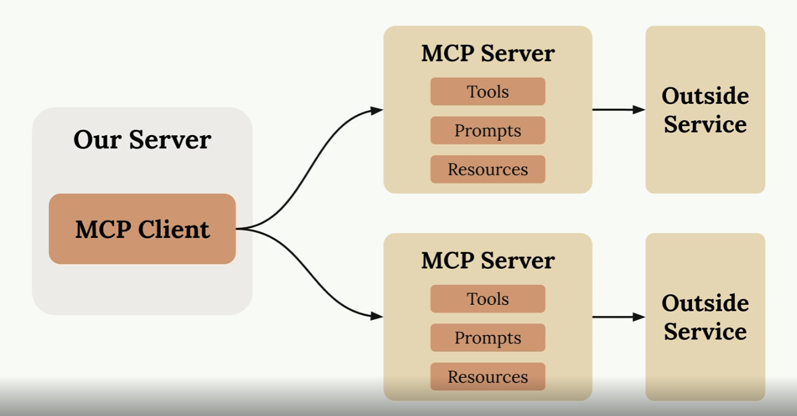

## MCP

- Overview of MCP
- Architecture Basics: MCP Clients and Servers

## Overview of MCP

Shifts the burden of maintaining bespoke tools to the vendor of those applications. For example, internal team X maintains application X. Rather than team Y building and maintaining tools to interact with application X, they can leverage MCP to launch a suite of tools provided and maintained by the X team.

It shifts the burden of defining and running tools from _our_ server to the MCP server. Think of it as an interface to some outside service.

When to use an MCP server? When you want your client to interact with an external service.

### Clients

MCP is transport agnostic. eg, it doesn't _have_ to be JSON-RPC. it's common to use standard IO, but can be REST, websockets, soap, whatever.

- TODO: talk about MCP Inspector

- ListToolsRequest <> ListToolsResult
- CallToolRequest <> CallToolResult

https://modelcontextprotocol.io/specification/2025-03-26/basic/transports

### Servers

- Tools
- Resources
- Prompts

## Agents

- Tools
- Code Interpreters
- Skills

https://www.anthropic.com/engineering/building-effective-agents

## Workshop

- Start by creating a very simple MCP server
- Then, create a simple client
